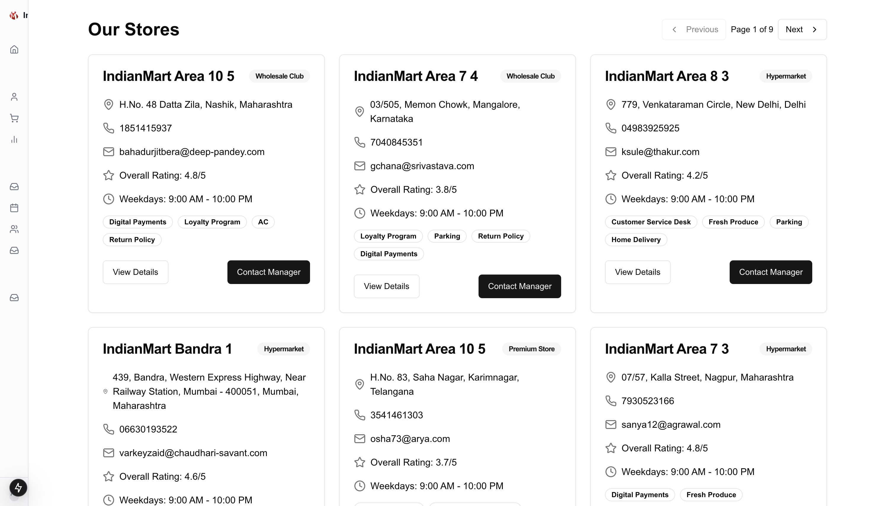
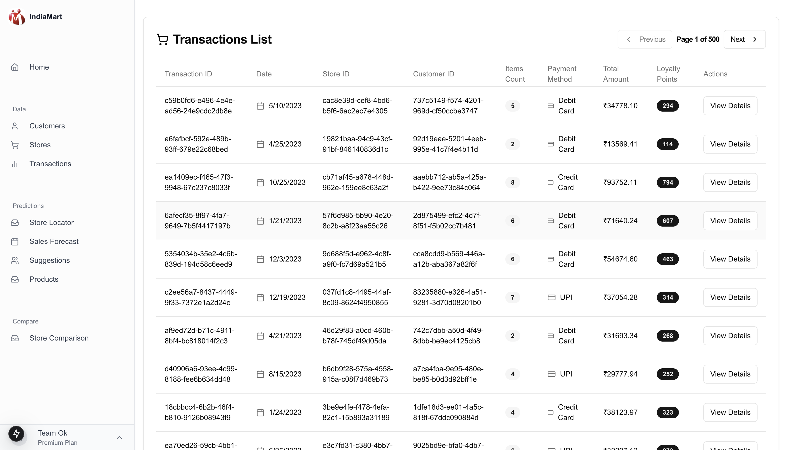
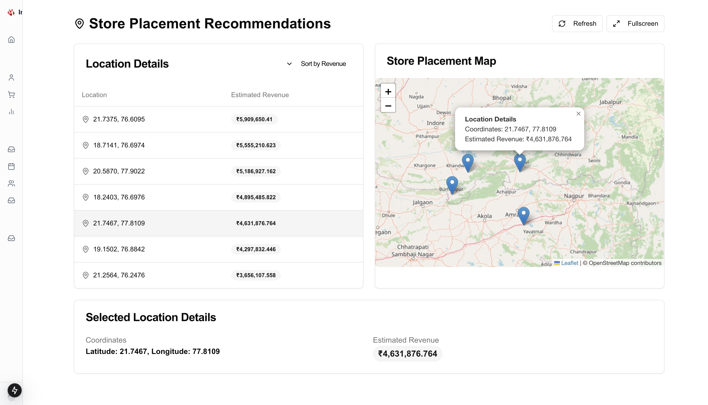
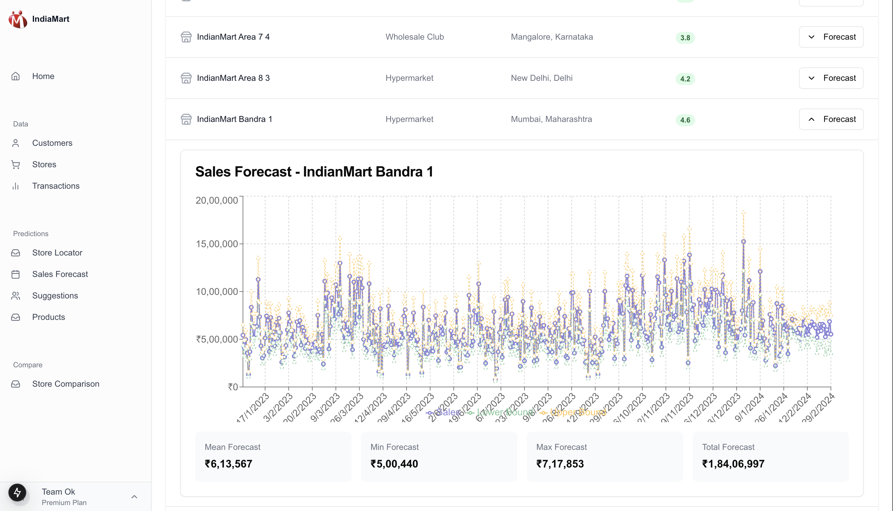
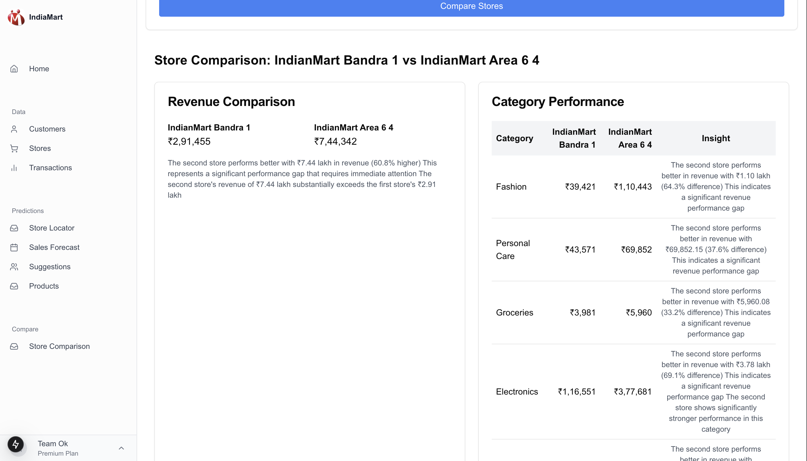
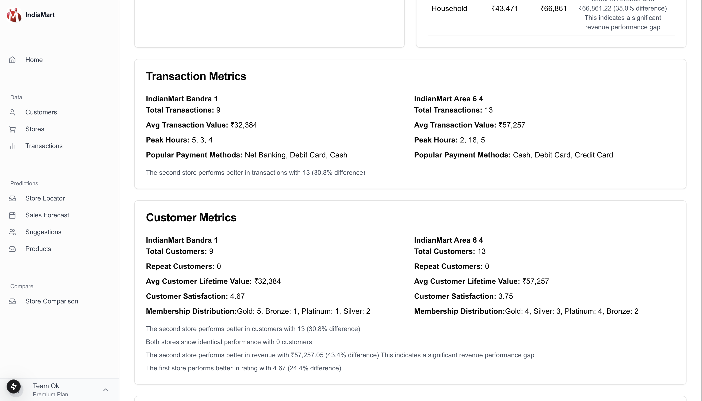
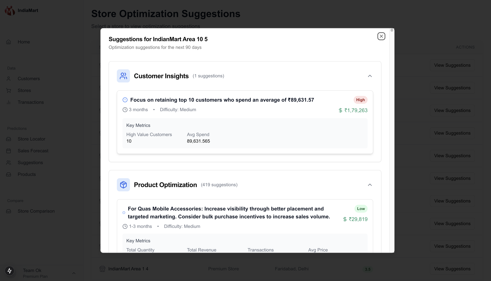
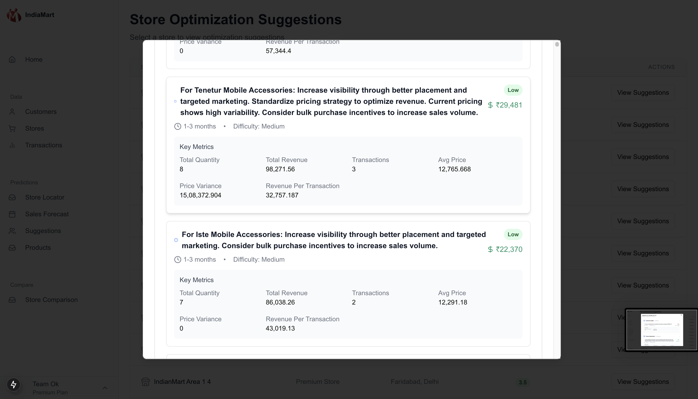
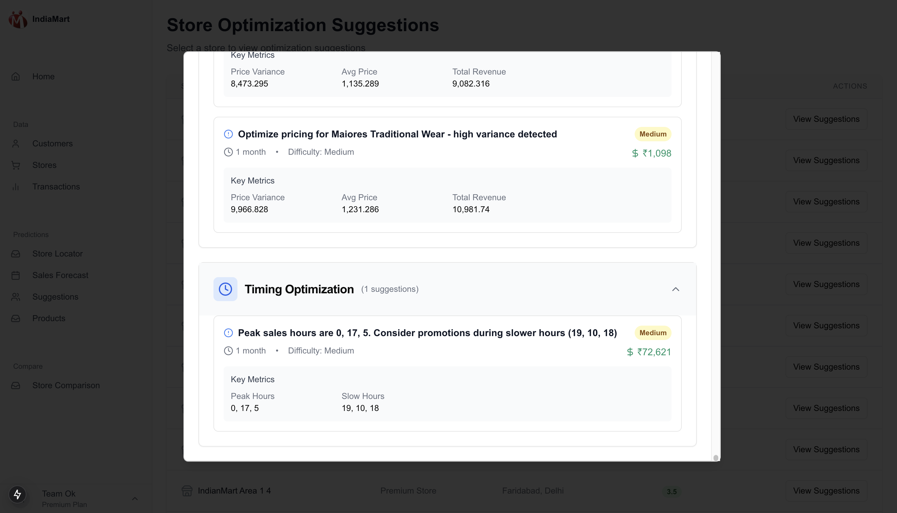

# Retail Outlet Preference and Sales Prediction Model

## 📌 Problem Statement
Retail businesses face challenges in understanding customer preferences and optimizing store placements. Our solution leverages machine learning to predict which retail outlets customers prefer based on their past purchases, product choices, and demographics. By combining multiple data sources, our model provides accurate forecasts for customer behavior and sales trends, helping businesses make informed decisions.

---

## 🛠️ Tech Stack
- **Programming Language**: Python, JavaScript
- **Frameworks**: FastAPI, Next.js (Frontend)
- **Machine Learning**: Scikit-Learn, TensorFlow
- **Database**: MongoDB
- **Version Control**: GitHub

---

## 📊 Dataset
Our model is trained on a dataset that includes:
- Customer purchase history
- Product choices and preferences
- Demographic data (age, location, etc.)
- Sales data from multiple retail outlets

---

## 📌 Features
✅ Predicts customer preferences for retail outlets
✅ Recommends store locations for maximum sales
✅ Generates personalized offers for customers
✅ Provides insights into sales trends
✅ API endpoints for integration with retail systems

---

## 🔧 Installation
### Clone the Repository
```bash
$ git clone https://github.com/Vivaan025/team-OK.git
$ cd team-OK
```

### Install Dependencies
```bash
$ pip install -r requirements.txt  # Backend dependencies
$ cd frontend && npm install       # Frontend dependencies
```

### Run the Backend Server
```bash
$ fastapi dev main.py
```

### Run the Frontend
```bash
$ cd client
$ npx next dev
```

---

## 🚀 Usage
1. Upload customer and sales data.
2. Run the machine learning model to generate predictions.
3. View personalized recommendations and store placement suggestions.
4. Access insights via the API or frontend dashboard.

---

## 📸 Screenshots
### 🔹 Dashboard



### 🔹 Store Placement Analysis


### 🔹 Sales Forecasting


### 🔹 Store Comparison



### 🔹 Store Suggestions




---

## 🏆 Hackathon Team
👨‍💼 **Suyog Mundhe** 
👨‍💻 **Aayush Mehta**
👨‍🎨 **Vivaan Lakhani**

---

## ⭐ Acknowledgments
- Thanks to the hackathon organizers for this opportunity.
- Special thanks to the mentors who guided us.
- Inspired by real-world retail analytics problems.